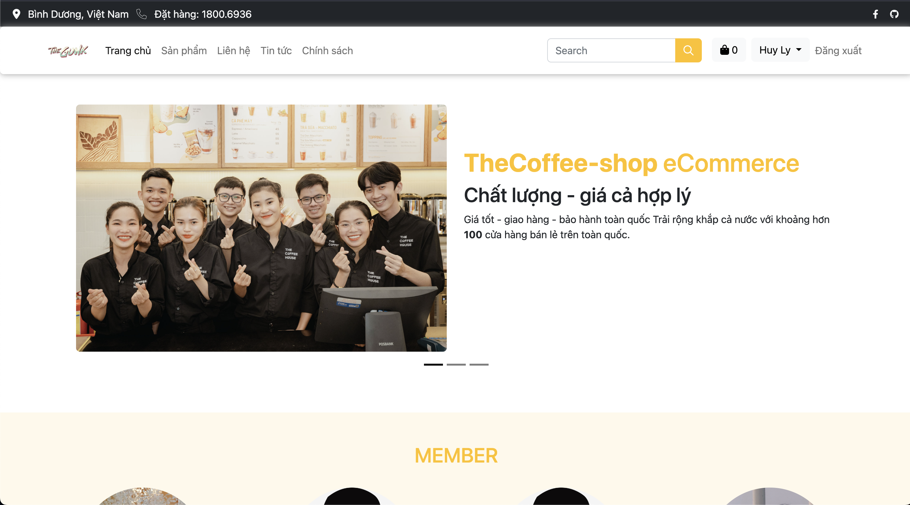
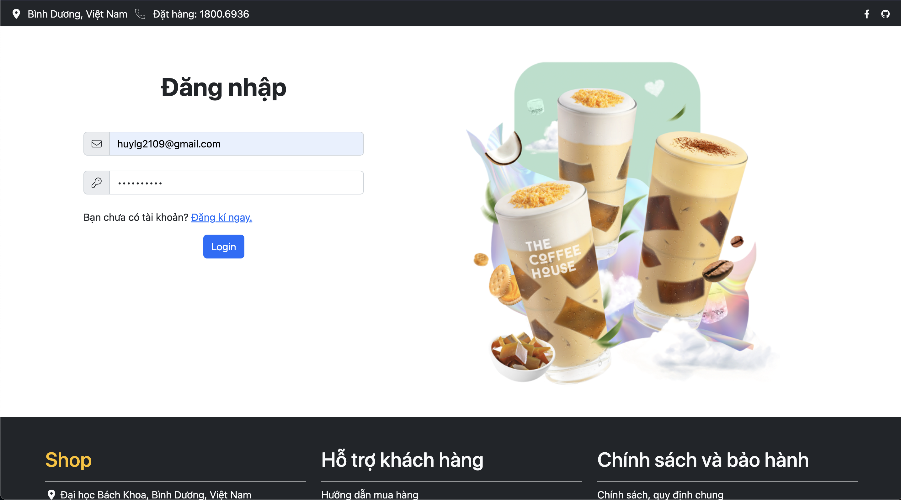
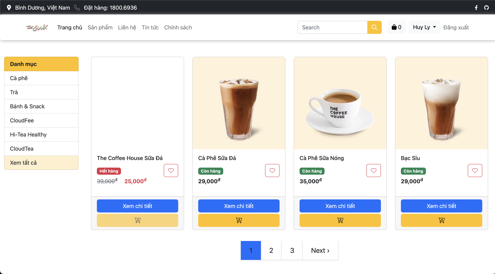
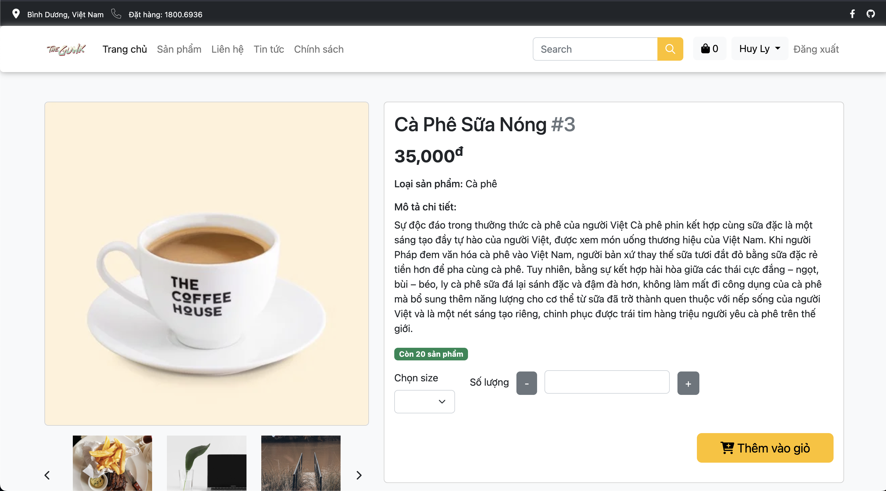
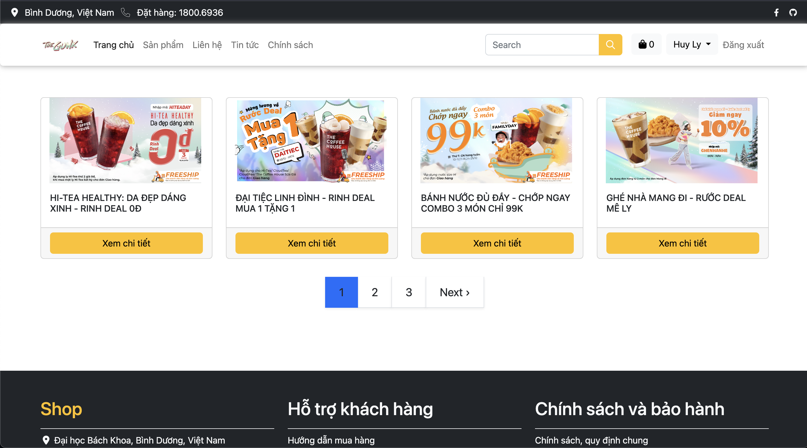

# The Website Introducing About The Coffee House
The app is built using pure PHP, without the use of any frameworks, and employs Bootstrap for the frontend design.

## 🚀 Features
- Login / Signup
- Use Encryption for Password
- Use Cookies to Authenticate User
- View & Update Account
- Add / Remove item to Cart
- View items with pagination
- View Orders History 
  
## 🖥️ Tech Stack
**Client :** Bootstrap, JavaScript

**Server :** PHP, MySQL

## Sneak Peek of Site

## Installation
* Install XAMPP 8.1.12
* Start Apache & MySQL
* Create database name 'assignmentweb' then import file `assignmentweb.sql` for database.
* Open with your browser with path : localhost/AssignmentWeb
